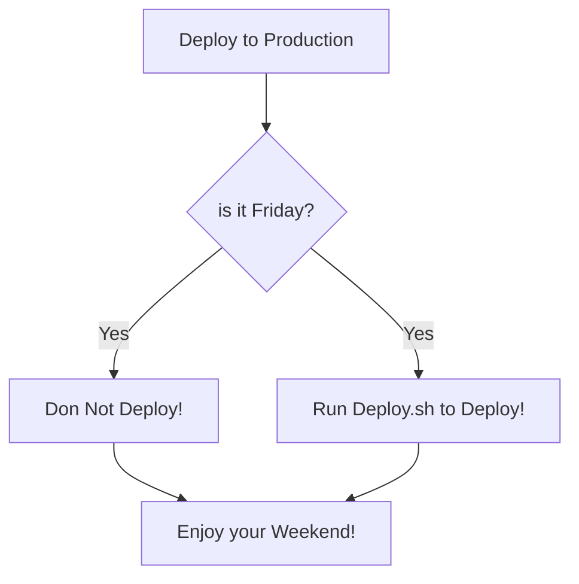

# mermaidDemo

```mermaid
flowchart TD
    A[Deploy to Production] --> B{is it Friday?};
    B -- Yes --> C[Don Not Deploy!];
    B -- Yes --> D[Run Deploy.sh to Deploy!];
    C --> E[Enjoy your Weekend!];
    D --> E[Enjoy your Weekend!];
```
