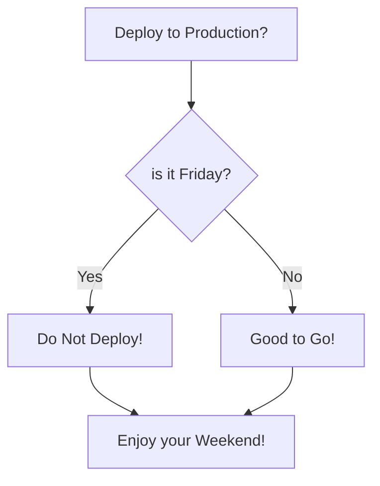

# mermaidDemo

```mermaid
flowchart TD
    A[Deploy to Production?] --> B{is it Friday?};
    B -- Yes --> C[Do Not Deploy!];
    B -- No --> D[Good to Go!];
    C --> E[Enjoy your Weekend!];
    D --> E[Enjoy your Weekend!];
```
